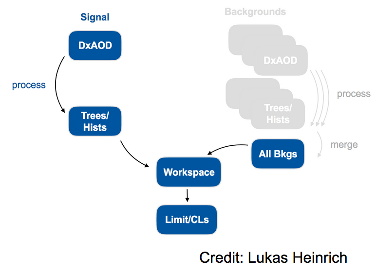

## Introduction

Thanks to gitlab and docker, we've now successfully preserved our analysis code and the environment in which we run it. The final piece of RECAST analysis preservation is to preserve and automate the process of passing an arbitrary signal model through our analysis chain to re-interpret the analysis in a new context. 

If it weren't for the docker containers involved in RECAST, this could conceivably be accomplished with some environment variables and bash scripts that just list out each command that an analyst would type into the terminal while going through the analysis. But when we perform the analysis steps in one or more docker containers, we need a way to codify what needs to happen in which container for each step, and how the output from one step feeds as the input for later steps, which may in general need to be done in different containers. Lukas Heinrich has written a great tool called yadage to handle this situation. 

## Yadage

[FIXME: briefly discuss yadage because it's good to have an idea of what's going on behind the scenes]

## Steps

[FIXME: introduce the concept of writing containerized steps]

[FIXME: add in a short exercise if needed to turn the hard-coded path to their DAOD into a command-line variable. Stress that it would probably make their lives easier when developing their analysis to try and avoid hard-coding things that could change when the analysis is RECASTed]

## Workflows

[FIXME: introduce the concept of connecting containerized steps into a workflow]

> ## Background preservation
> Recall that a real ATLAS analysis will have "backgrounds", i.e. standard model processes producing events that pass the signal selection cuts applied in your analysis. Since these background contributions won't change when the analysis is re-interpreted with a new model, it's in general important to preserve the contribution of these backgrounds to the final analysis results in the analysis code so that only need to run the signal DAOD through the whole analysis chain when the analysis is re-interpreted with RECAST. 
>
>   
{: .callout}



